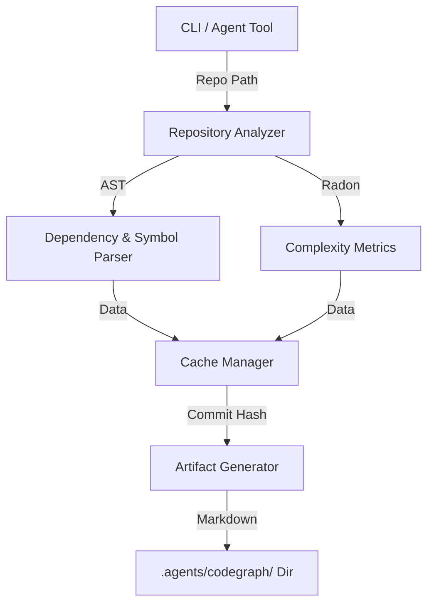

# CodeGraph 🕸️

<p align="center">
  
</p>

<p align="center">
  <strong>Transform your codebases into meaningful artifacts for AI Agents.</strong>
</p>

<p align="center">
  
  
  
  
</p>

---

## 🎯 What is CodeGraph?

**CodeGraph** is a specialized analysis engine designed to help AI Agents (and humans) understand complex codebases at scale. By performing deep AST parsing and metric analysis, it generates structured Markdown artifacts that fit perfectly into an LLM's context window.

Whether you're building a coding assistant or automating documentation, CodeGraph makes the "hidden anatomy" of your project digestible for machines.

## ✨ Key Features

- 🤖 **AI Agent Ready** – Generates structured `.md` files designed for LLM consumption.
- 📂 **Standardized Context** – Outputs all artifacts to a `.agents/` folder for easy agent discovery.
- 📊 **Granular Metrics** – Tracks **Cyclomatic Complexity** at the file AND function level.
- 📦 **Symbol Extraction** – Automatically extracts class definitions, function signatures, and docstrings.
- ⚡ **Git-Hash Caching** – Tracks your current commit hash to ensure artifacts are never stale.
- 🛠️ **CLI-First** – Powerful headless mode for automation and CI/CD pipelines.

## 🚀 Quick Start

### 📋 Prerequisites
- **Python 3.10+**
- **Git**

### 🛠️ Installation

1. **Clone the repo:**
   ```bash
   git clone https://github.com/bluekap/codegraph.git
   cd codegraph/backend
   ```
2. **Setup and Install:**
   ```bash
   python -m venv venv
   source venv/bin/activate  # Windows: venv\Scripts\activate
   pip install -e .          # Installs 'codegraph' command globally in your venv
   ```

## 💻 Usage

Once installed, you can use the `codegraph` command directly.

### 🔍 Analyze a Repository
Analyze the current directory and generate artifacts in `.agents/codegraph/`:
```bash
codegraph analyze .
```

### 🎯 Analyze Specific Files
Filter analysis to specific modules:
```bash
codegraph analyze . --files "src/**/*.py"
```

### 🔄 Force Regeneration
Skip the cache and re-analyze everything:
```bash
codegraph analyze . --force
```

### 📤 Export Data
Export analysis to a specific format (stdout or file):
```bash
codegraph export . --format mermaid --out graph.mmd
```

### 🧪 Validate Cache
Check if your existing artifacts match the current git commit:
```bash
codegraph validate .
```

> [!TIP]
> If the `codegraph` command fails due to spaces in your file path (e.g., `bad interpreter`), you can always run the tool reliably using:
> ```bash
> python -m codegraph analyze .
> ```

---

## 📁 Generated Artifacts

When you run `analyze`, an `.agents/codegraph/` folder is created at your repo root containing:

- **`architecture.md`**: High-level repository stats and a **Mermaid.js** dependency graph.
- **`modules.md`**: A complete breakdown of classes and functions with their docstrings.
- **`hotspots.md`**: Ranked lists of the most complex files and functions for targeted refactoring.
- **`cache.json`**: Stores the git hash and raw analysis data for instant reloading.

## 🤖 Agent Integration

CodeGraph provides a dedicated module for AI Agent frameworks (like LangChain):

```python
from codegraph.agent_tools import get_repository_architecture, get_module_details

# Give these tools to your Agent!
tools = [
    get_repository_architecture,
    get_module_details
]
```

---

## 🏗️ How It Works


```mermaid
graph TD
    CLI[CLI / Agent Tool] -->|Repo Path| ANALYZER[Repository Analyzer]
    ANALYZER -->|AST| PARSER[Dependency & Symbol Parser]
    ANALYZER -->|Radon| METRICS[Complexity Metrics]
    PARSER -->|Data| CACHE[Cache Manager]
    METRICS -->|Data| CACHE
    CACHE -->|Commit Hash| ARTIFACTS[Artifact Generator]
    ARTIFACTS -->|Markdown| OUTPUT[.agents/codegraph/ Dir]
```

---

## 📜 License

Distributed under the **MIT License**. See `LICENSE` for more information.

## 📧 Contact

**bluekap** - [@bluekap](https://github.com/bluekap) - vabg96@yahoo.com

**Project Link**: [https://github.com/bluekap/codegraph](https://github.com/bluekap/codegraph)

---
<p align="center">Made with ❤️ for the AI Developer Community</p>
