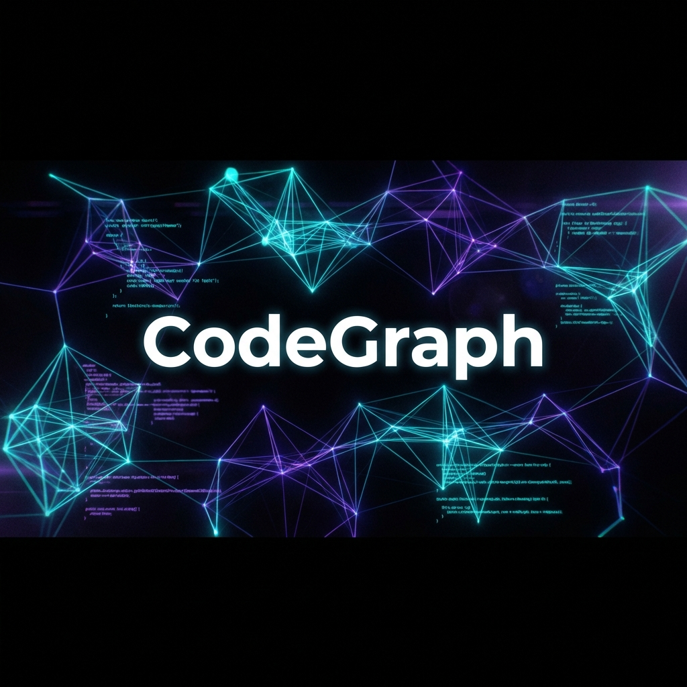
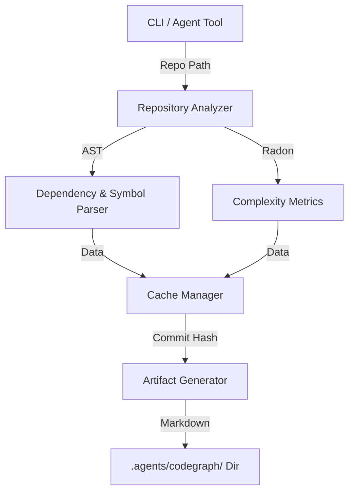

# CodeGraph 🕸️

<p align="center">
  
</p>

<p align="center">
  <strong>Transform your codebase into structured, readable memory for AI Agents.</strong>
</p>

<p align="center">
  
  
  
  
</p>

---

## 🎯 The Problem

When you ask an AI Agent to "fix a bug" or "refactor a feature" in a large repository, it struggles. LLMs have limited context windows and cannot easily "browse" thousands of files to understand how your project is wired together or where the technical debt lies.

## 💡 The Solution: CodeGraph

**CodeGraph** is a headless analysis engine that runs locally on your machine. It parses backend and frontend source files (Python, JavaScript, TypeScript, React, Vue, Svelte) and calculates complexity metrics, then condenses that knowledge into highly structured **Markdown artifacts**. 

These artifacts are placed in a `.agents/codegraph/` folder. When an AI Agent reads this folder, it instantly gains a "Senior Developer's" understanding of your architecture, module exports, and complexity hotspots—without needing to read your entire source code.

---

## ✨ What It Generates

Running CodeGraph produces the following files in your repository's `.agents/codegraph/` directory:

1. **`architecture.md`**: Contains a high-level summary and a **Mermaid.js dependency graph** showing how your files import each other.
2. **`modules.md`**: A dictionary of your codebase. It lists every class, method, and function along with its exact signature and docstring.
3. **`hotspots.md`**: A ranked list highlighting the most complex files and functions (calculated via Cyclomatic Complexity). *Perfect for telling an Agent: "Find and refactor the most complex function in the repo."*
4. **`cache.json`**: A git-aware cache. CodeGraph tracks your `git commit` hash to ensure it only regenerates artifacts if your code has actually changed.

---

## 🚀 Installation & Setup

### Prerequisites
- Python 3.10+
- Git

### Installation Steps

Currently, the engine lives in the `backend/` directory of this repository.

1. **Clone the repository:**
   ```bash
   git clone https://github.com/bluekap/codegraph.git
   cd codegraph/backend
   ```
2. **Create a Virtual Environment:**
   ```bash
   python -m venv venv
   source venv/bin/activate  # On Windows use: venv\Scripts\activate
   ```
3. **Install the CLI Globally (Editable Mode):**
   ```bash
   pip install -e .
   ```
   *This installs the `codegraph` command so you can use it in any folder while your virtual environment is active.*

---

## 💻 CLI Usage

Once installed, you can use the `codegraph` command to analyze any local repository.

### 🔍 1. Basic Analysis (Most Common)
Navigate to any backend or full-stack project on your computer and run:
```bash
codegraph analyze .
```
*This will create the `.agents/codegraph/` folder and populate it with Markdown artifacts.*

### 🎯 2. Targeted Analysis
If you only want to analyze specific folders (like `src` and `ui`):
```bash
codegraph analyze . --files "src/**/*"
```

### 🔄 3. Force Regeneration
If you want to skip the git-hash cache and force CodeGraph to parse everything again:
```bash
codegraph analyze . --force
```

### 📁 4. Custom Output Directory
If you want to write artifacts and cache somewhere else:
```bash
codegraph analyze . --output-dir ".agents/fullstack-memory"
```
You can pass either a relative path (resolved from repo root) or an absolute path.

### 🧪 5. Validate Cache Status
Quickly check if the artifacts in `.agents/codegraph/` are up-to-date with your latest git commit:
```bash
codegraph validate .
```

### 📤 6. Export Data
If you want to export the raw data to `stdout` or a specific file format (JSON, Markdown, or Mermaid) without writing to the `.agents/` directory:
```bash
codegraph export . --format mermaid --out graph.mmd
```

> [!TIP]
> **Path Issues?** If the `codegraph` command fails with a "bad interpreter" error (common if your folder paths contain spaces), use the module command instead:
> ```bash
> python -m codegraph analyze .
> ```

---

## 🤖 Using CodeGraph with AI Agents

If you are building your own AI Agent (e.g., using LangChain, AutoGen, or CrewAI), you can give your Agent direct access to CodeGraph's query tools.

We provide pre-built `@tool` wrappers that read the generated `.agents/` artifacts safely.

```python
from codegraph.agent_tools import (
    get_repository_architecture, 
    get_module_details, 
    get_complexity_hotspots
)

# Give these tools to your LangChain/OpenAI Agent
tools = [
    get_repository_architecture,
    get_module_details,
    get_complexity_hotspots
]
```
*Now, if you ask your Agent "What does this repo do?", it will automatically call `get_repository_architecture` and read the Mermaid diagram!*

---

## 🏗️ Internal Architecture


```mermaid
graph TD
    CLI[CLI / Agent Tool] -->|Repo Path| ANALYZER[Repository Analyzer]
    ANALYZER -->|AST| PARSER[Dependency & Symbol Parser]
    ANALYZER -->|Radon| METRICS[Complexity Metrics]
    PARSER -->|Data| CACHE[Cache Manager]
    METRICS -->|Data| CACHE
    CACHE -->|Commit Hash| ARTIFACTS[Artifact Generator]
    ARTIFACTS -->|Markdown| OUTPUT[.agents/codegraph/ Dir]
```

---

## 📜 License & Contact

Distributed under the **MIT License**. See `LICENSE` for more information.

**bluekap** - [@bluekap](https://github.com/bluekap) - vabg96@yahoo.com  
**Project Link**: [https://github.com/bluekap/codegraph](https://github.com/bluekap/codegraph)

---
<p align="center">Made with ❤️ for the AI Developer Community</p>
