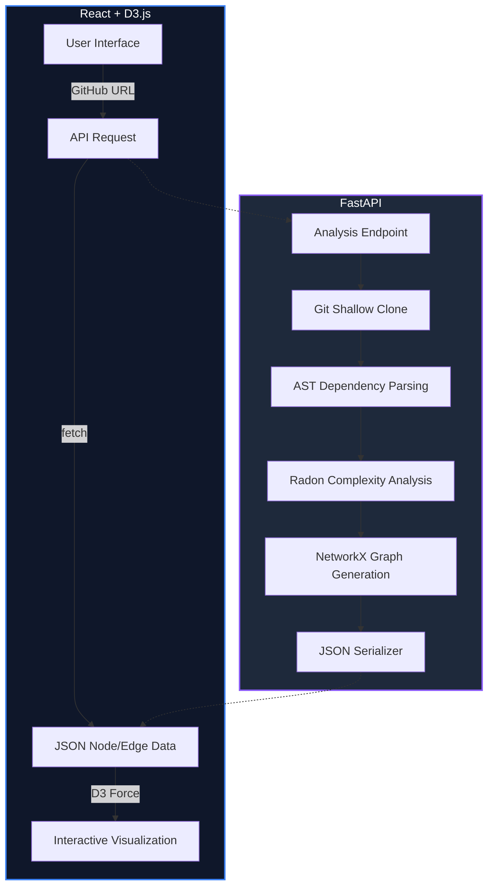

# CodeGraph 🕸️

<p align="center">
  
</p>

<p align="center">
  <strong>Transform your GitHub repositories into beautiful, interactive, and insightful dependency graphs.</strong>
</p>

<p align="center">
  
  
  
  
  
</p>

---

## 🎯 What is CodeGraph?

**CodeGraph** is a powerful full-stack visualization tool designed to help developers and architects understand complex codebases at a glance. By analyzing repository structures and import relationships, it generates an interactive, force-directed network graph that reveals the "hidden anatomy" of your project.

Whether you're onboarding to a new project, refactoring legacy code, or documenting your architecture, CodeGraph makes the invisible visible.

## ✨ Key Features

- 🎨 **Force-Directed Visualization** – Explore your codebase through a dynamic, responsive graph with smooth physics simulations.
- 📊 **Rich Metrics & Heatmaps** – Nodes are color-coded by **Cyclomatic Complexity** (Green → Orange → Red) and sized by **Lines of Code**.
- 🎯 **Intelligent Dependency Tracing** – Click any node to instantly highlight its upstream and downstream dependencies.
- 🔍 **Real-time Search** – Quickly locate specific files or modules within large codebases.
- 🌓 **Theme Support** – Beautiful Light and Dark modes tailored for developer comfort.
- ⚡ **Async Analysis** – Built with FastAPI for high-performance, non-blocking repository processing.

## 🚀 Quick Start

### ⚡ One-Click Start (Recommended)

The easiest way to get CodeGraph up and running is to use our bundled start scripts. These will automatically handle environment setup, dependency installation, and launch both the backend and frontend for you.

**Windows:**
```cmd
start.bat
```

**macOS / Linux:**
```bash
chmod +x start.sh
./start.sh
```

---

### 📋 Prerequisites
- **Python 3.10+**
- **Node.js 18+**
- **Git**

### 🛠️ Manual Setup (Optional)

If you prefer to set up the environment manually:

1. **Clone the repo:**
   ```bash
   git clone https://github.com/bluekap/codegraph.git
   cd codegraph
   ```
2. **Backend**: `cd backend && python -m venv venv && source venv/bin/activate && pip install -r requirements.txt && uvicorn app.main:app --reload`
3. **Frontend**: `cd frontend && npm install && npm start`

Visit **`http://localhost:3000`** and enter any public GitHub URL (e.g., `https://github.com/pallets/flask`)!

## 🏗️ How It Works



1.  **Clone**: The backend performs a shallow clone (`depth=1`) of the target repository to minimize disk usage and speed up analysis.
2.  **Analyze**: Python's `ast` module parses imports to build the network, while `Radon` calculates cyclomatic complexity for every file.
3.  **Graphing**: Relationships are processed via `NetworkX` to ensure integrity and exported as a specialized JSON structure.
4.  **Visualize**: The frontend uses a custom **D3.js Force Simulation** centered on stability and elegant animations to render the data.

## 🛠️ Tech Stack

### Backend
- **FastAPI**: Modern, high-performance web framework.
- **GitPython**: Handling repository operations.
- **Radon**: Computing cyclomatic complexity.
- **NetworkX**: Advanced graph algorithms and structure.

### Frontend
- **React 18**: Component-based UI logic.
- **TypeScript**: Type-safe development.
- **D3.js (v7)**: Industry-standard data visualization.
- **Tailwind CSS**: Modern, utility-first styling.

## 🎯 Roadmap

- [ ] **Multi-language Support**: Support for JS/TS, Java, and Go.
- [ ] **GitHub API Integration**: Analyze without full cloning for faster results.
- [ ] **Historical Analysis**: Visualize how dependencies have evolved across commits.
- [ ] **Export Options**: Save your graphs as high-resolution PNG or SVG.
- [ ] **VS Code Extension**: Bring CodeGraph directly into your editor.

## 🤝 Contributing

Contributions are what make the open-source community such an amazing place to learn, inspire, and create. Any contributions you make are **greatly appreciated**.

1. Fork the Project
2. Create your Feature Branch (`git checkout -b feature/AmazingFeature`)
3. Commit your Changes (`git commit -m 'Add some AmazingFeature'`)
4. Push to the Branch (`git push origin feature/AmazingFeature`)
5. Open a Pull Request

## 📜 License

Distributed under the **MIT License**. See `LICENSE` for more information.

## 📧 Contact

**bluekap** - [@bluekap](https://github.com/bluekap) - vabg96@yahoo.com

**Project Link**: [https://github.com/bluekap/codegraph](https://github.com/bluekap/codegraph)

---
<p align="center">Made with ❤️ for the Developer Community</p>
<p align="center">⭐ If you like this project, give it a star on GitHub!</p>
