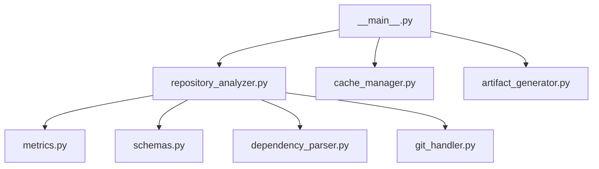

# File-Level Architecture

## Repository Stats
- **Total Files**: 10
- **Total Lines of Code**: 1203
- **Average Complexity**: 3.93

## Dependency Graph

```mermaid
graph TD;
    backend_codegraph_analyzer_repository_analyzer_py["repository_analyzer.py"] --> backend_codegraph_analyzer_metrics_py["metrics.py"];
    backend_codegraph_analyzer_repository_analyzer_py["repository_analyzer.py"] --> backend_codegraph_models_schemas_py["schemas.py"];
    backend_codegraph_analyzer_repository_analyzer_py["repository_analyzer.py"] --> backend_codegraph_analyzer_dependency_parser_py["dependency_parser.py"];
    backend_codegraph___main___py["__main__.py"] --> backend_codegraph_analyzer_repository_analyzer_py["repository_analyzer.py"];
    backend_codegraph___main___py["__main__.py"] --> backend_codegraph_analyzer_cache_manager_py["cache_manager.py"];
    backend_codegraph_analyzer_repository_analyzer_py["repository_analyzer.py"] --> backend_codegraph_analyzer_git_handler_py["git_handler.py"];
    backend_codegraph___main___py["__main__.py"] --> backend_codegraph_analyzer_artifact_generator_py["artifact_generator.py"];
```
